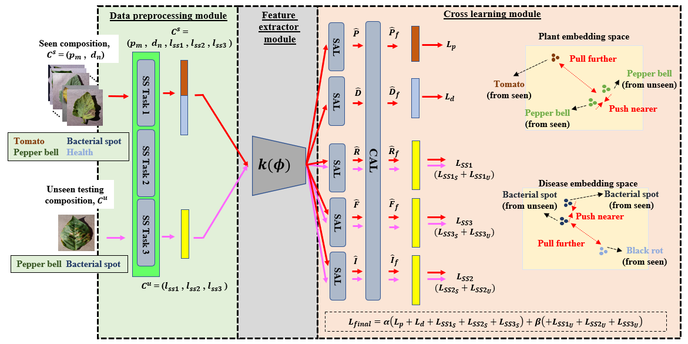
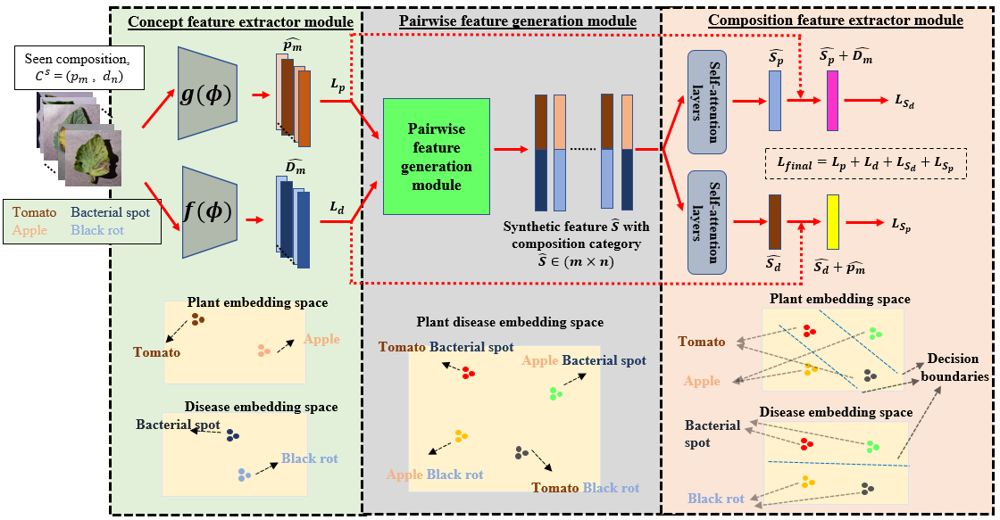

# Beyond-supervision-Harnessing-self-supervised-learning-in-unseen-plant-disease-recognition

## Introduction
This is a pytorch implementation for CL-ViT and FF-ViT in [Beyond supervision: Harnessing self-supervised learning in unseen plant disease recognition](https://www.sciencedirect.com/science/article/pii/S0925231224013791)




## Results

## Preparation

## See also

## License

## Citation

```bibtex
@article{chai2024beyond,
  title={Beyond supervision: Harnessing self-supervised learning in unseen plant disease recognition},
  author={Chai, Abel Yu Hao and Lee, Sue Han and Tay, Fei Siang and Bonnet, Pierre and Joly, Alexis},
  journal={Neurocomputing},
  pages={128608},
  year={2024},
  publisher={Elsevier}
}
