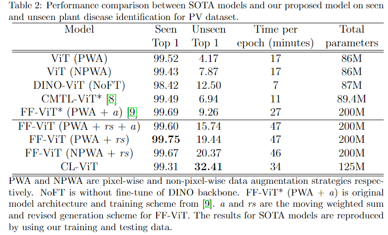

# Beyond-supervision-Harnessing-self-supervised-learning-in-unseen-plant-disease-recognition

## Introduction
This is a pytorch implementation for CL-ViT and FF-ViT in [Beyond supervision: Harnessing self-supervised learning in unseen plant disease recognition](https://www.sciencedirect.com/science/article/pii/S0925231224013791)


<div align="center">
Proposed CL-ViT architecture
</div>


<div align="center">
Proposed FF-ViT architecture
</div>

The contributions of this paper:
1. We demonstrate that the incorporation of a guided learning mechanism surpasses conventional approaches in the multi-plant disease identification benchmark. Furthermore, we show that the CL-ViT model, integrating a SSL approach, outperforms the FF-ViT model employing a purely supervisory learning scheme for unseen plant disease identification tasks.
2. In our qualitative analyses, we illustrate that CL-ViT learns a feature space capable of discriminating between different classes while minimizing the domain gap between seen and unseen data. This underscores the superiority of CL-ViT in implementing a more effective guided learning mechanism.

## Results

## Preparation

Dataset: [spMohanty Github](https://github.com/spMohanty/PlantVillage-Dataset/tree/master)  
(You can group all images into single folder to directly use the csv file provided in this repo)

## See also

## License

## Citation

```bibtex
@article{chai2024beyond,
  title={Beyond supervision: Harnessing self-supervised learning in unseen plant disease recognition},
  author={Chai, Abel Yu Hao and Lee, Sue Han and Tay, Fei Siang and Bonnet, Pierre and Joly, Alexis},
  journal={Neurocomputing},
  pages={128608},
  year={2024},
  publisher={Elsevier}
}
